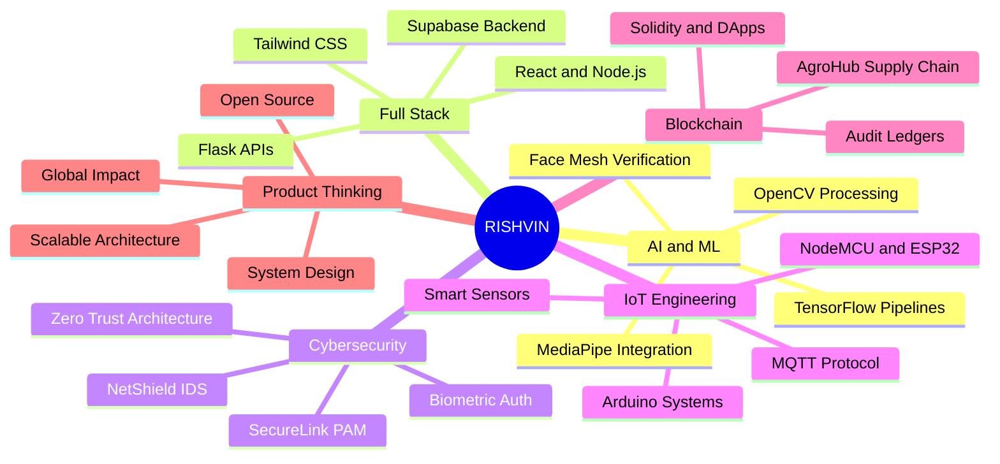
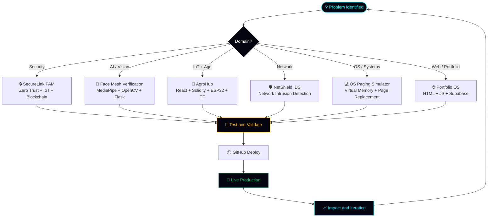
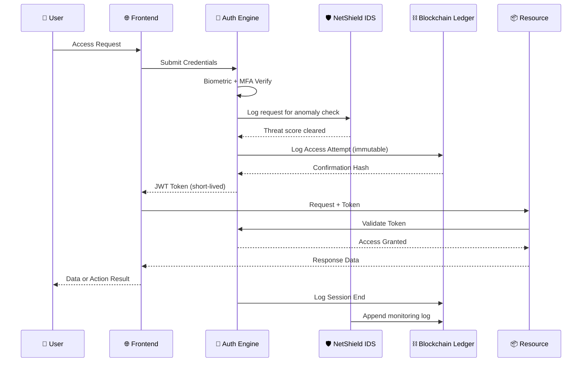
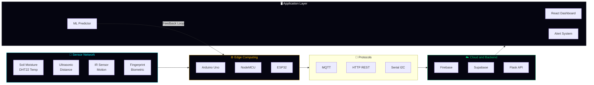
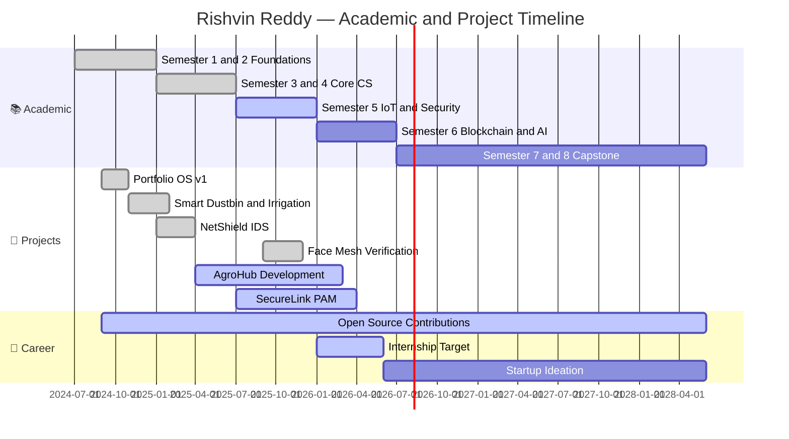
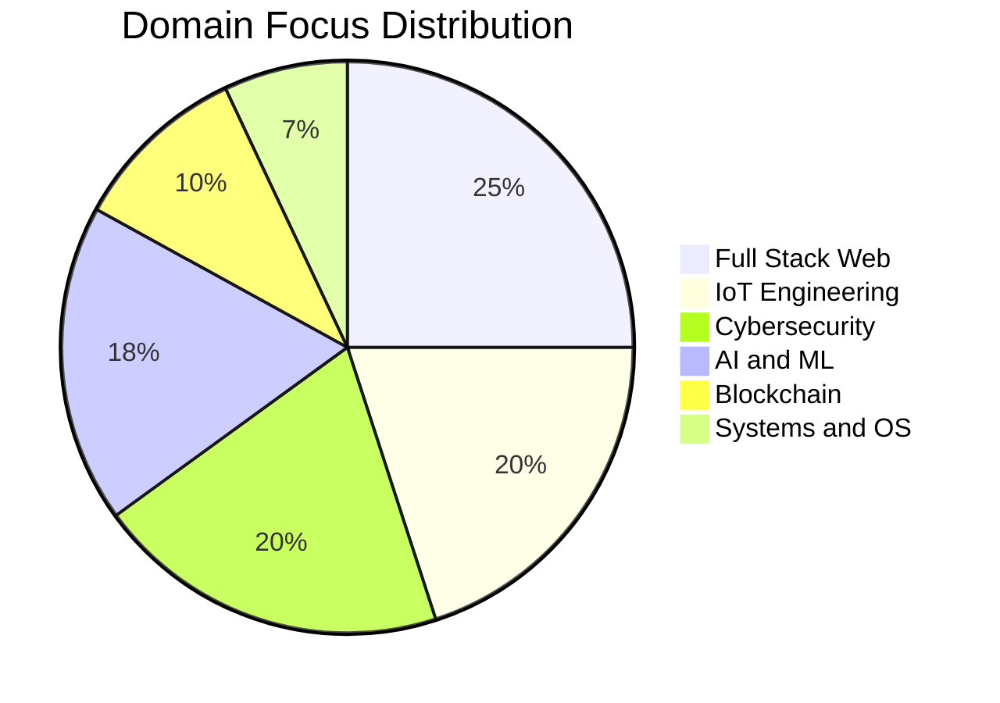
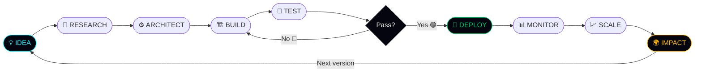

<div align="center" style="font-family: 'Times New Roman', serif;">


<br/>

<h1 style="font-size:48px; margin-bottom:10px;">
EROLLA RISHVIN REDDY
</h1>

<p style="font-size:22px; color:#94a3b8; margin-top:0;">
IoT • Backend • Cybersecurity Developer
</p>

</div>


<!-- 🔥 MAIN WRAPPER -->
<div align="center">

  <!-- 👁️ LIVE METRICS -->
  

  <br/><br/>

  <!-- ⚡ CONTRIBUTION HEATMAP -->
  

  <br/><br/>

  <!-- 📊 DASHBOARD ROW 1 -->
  <p>
    
    
  </p>

  <!-- 📊 DASHBOARD ROW 2 -->
  <p>
    
    
  </p>

  <br/>

  <!-- 🏆 TROPHIES -->
  

  <br/><br/>

  <!-- 🔥 ACTIVITY GRAPH -->
  

</div>


<div align="center">

<!-- 🌌 ULTRA CINEMATIC HEADER -->


<!-- 🔥 ANIMATED SEPARATOR -->


<!-- ⚡ HIGH-END TYPING ENGINE -->


<br/>

<!-- 🧠 GLASS BADGE LAYER -->
<p>
  
  
  
  
</p>

<!-- 👁️ LIVE METRICS -->


<br/>

<!-- ⚡ CONTRIBUTION HEATMAP (RARE FEATURE) -->


<br/>

<!-- 📊 ADVANCED DASHBOARD -->


<br/>


<br/>

<!-- 🏆 TROPHY SYSTEM -->


<br/>

<!-- 🔥 ACTIVITY GRAPH -->


<br/>

<!-- 🌊 FOOTER -->


</div>


<div align="center">

<!-- 🌌 BACKGROUND + DEPTH LAYER -->


<!-- ⚡ NEON DIVIDER -->


<!-- 🧠 DYNAMIC IDENTITY SYSTEM -->


<br/>

<!-- 🔗 ELITE BADGES -->
<p>
  
  
  
  
</p>

<!-- 👁️ LIVE SIGNALS -->


<br/>

<!-- ⚡ ACTIVITY GRAPH (THIS IS BIG UPGRADE) -->


<br/>

<!-- 🏆 TROPHIES -->


<br/>

<!-- 📊 FULL DASHBOARD -->


<br/>

<!-- 💻 LANGUAGE INTELLIGENCE -->


<!-- 🔥 FOOTER WAVE -->


</div>


<div align="center">

<!-- 🔥 CINEMATIC HEADER -->


<!-- 🚀 DYNAMIC ROLE SYSTEM -->


<br/>

<!-- 🔗 SOCIAL + BRAND BADGES -->
<p>
  
  
  
</p>

<!-- 🧠 PROFILE VIEWS + FOLLOWERS -->


<br/>

<!-- 🏆 TROPHIES -->


<br/>

<!-- 📊 STATS GRID -->


<br/>

<!-- 💻 TOP LANGUAGES -->


</div>


<div align="center">


<br/>


<br/>


<br/>


</div>


<div align="center">


<br>

<table align="center" border="0" cellpadding="0" cellspacing="0" width="100%" style="background-color: transparent;">
  <tr>
    <td width="50%" align="center" valign="top">
       <h3 align="center"><font color="#00F7FF">⬡ LIVE TELEMETRY ⬡</font></h3>
       
    </td>
    <td width="50%" align="center" valign="top">
       <h3 align="center"><font color="#A855F7">⬡ NEURAL NETWORK ⬡</font></h3>
       
    </td>
  </tr>
</table>

<br><br>

<div align="left" style="background-color: #050510; padding: 20px; border-radius: 10px; border: 1px solid #00F7FF; font-family: 'Fira Code', monospace;">
  <code><font color="#A855F7">root@woxsen-mainframe:~#</font> <font color="#ffffff">./initialize_portfolio.sh</font></code><br><br>
  <code><font color="#00C86F">[ OK ]</font> <font color="#ffffff">Loading Automotive Telemetry & Engine Diagnostics...</font></code><br>
  <code><font color="#00C86F">[ OK ]</font> <font color="#ffffff">Booting Smart Waste & Irrigation Protocols...</font></code><br>
  <code><font color="#00C86F">[ OK ]</font> <font color="#ffffff">Compiling Text Search Engine & Pattern Matching Algorithms...</font></code><br>
  <code><font color="#00C86F">[ OK ]</font> <font color="#ffffff">Establishing Secure Connection to Agro Hub Node...</font></code><br>
  
  <br>
  <details>
    <summary style="cursor: pointer;"><b><font color="#00F7FF">>> CLICK TO EXPAND: ACTIVE SUBSYSTEMS <<</font></b></summary>
    <br>
    <code><font color="#FF00FF">>> </font><font color="#ffffff">Biometric Voting System: ONLINE</font></code><br>
    <code><font color="#FF00FF">>> </font><font color="#ffffff">Disaster Management Drone Control: STANDBY</font></code><br>
    <code><font color="#FF00FF">>> </font><font color="#ffffff">Network Sec & Cryptography Modules: ACTIVE</font></code><br>
  </details>
</div>

<br><br>

<h2 align="center"><font color="#A855F7">⬡ TEMPORAL ACTIVITY MATRIX ⬡</font></h2>
<picture>
  <source media="(prefers-color-scheme: dark)" srcset="https://raw.githubusercontent.com/RishvinReddy/RishvinReddy/output/github-contribution-grid-snake-dark.svg">
  
</picture>


</div>


-----

<!-- ═══════════════════════════════════════════════════════════ -->

<!--                   ⬡  IDENTITY CORE  ⬡                     -->

<!-- ═══════════════════════════════════════════════════════════ -->

<div align="center">

### ⬡   I D E N T I T Y   C O R E   ⬡

</div>

```
╔══════════════════════════════════════════════════════════════════════╗
║                        RISHVIN.CORE  v3.0                           ║
╠══════════════════════════════════════════════════════════════════════╣
║                                                                      ║
║  entity        : Rishvin Reddy                                      ║
║  role          : Engineer · Builder · System Thinker                ║
║  institute     : Woxsen University — CSE-BIC '28                    ║
║  speciality    : IoT · Blockchain · Cyber Security                  ║
║  location      : Hyderabad, India  🇮🇳                               ║
║                                                                      ║
║  domains:                                                            ║
║    ├─ 🤖  AI & Machine Learning Systems                             ║
║    ├─ 🌐  Full Stack Web Development                                ║
║    ├─ 🔒  Cybersecurity & Network Engineering                       ║
║    ├─ 📡  IoT System Architecture                                   ║
║    ├─ ⛓️   Blockchain & Distributed Ledgers                         ║
║    └─ 💡  Product Thinking & Startup Mindset                        ║
║                                                                      ║
║  current_state:                                                      ║
║    semester    : 5th Semester  (3rd Year)                           ║
║    focus       : AI + Scalable Systems + Zero Trust Security        ║
║    mindset     : Build Fast · Ship Often · Impact at Scale          ║
║    mission     : Create systems used by millions 🌍                 ║
║                                                                      ║
║  achievements:                                                       ║
║    🏆  Best Project Ideas & Problem-Solving Award — 2024            ║
║    🎓  Academic Excellence Recognition — 2023                       ║
║    🔧  17+ Public GitHub Repositories                               ║
║    🎤  20+ Technical Workshops Facilitated                          ║
║                                                                      ║
║  status        : ONLINE  🟢  actively building                      ║
╚══════════════════════════════════════════════════════════════════════╝
```

-----

<!-- ═══════════════════════════════════════════════════════════ -->

<!--              ⬡  SYSTEM ARCHITECTURE MAP  ⬡                 -->

<!-- ═══════════════════════════════════════════════════════════ -->

<div align="center">

### ⬡   S Y S T E M   A R C H I T E C T U R E   ⬡

</div>

```
                         ╔═══════════════════╗
                         ║   RISHVIN.SYS     ║
                         ║   CORE ENGINE     ║
                         ╚════════╤══════════╝
                                  │
           ┌──────────────────────┼──────────────────────┐
           │                      │                      │
    ╔══════╧══════╗      ╔════════╧════════╗    ╔════════╧════════╗
    ║  AI / ML    ║      ║   FULL STACK    ║    ║  CYBERSECURITY  ║
    ║   LAYER     ║      ║   WEB LAYER     ║    ║     LAYER       ║
    ╠═════════════╣      ╠═════════════════╣    ╠═════════════════╣
    ║ MediaPipe   ║      ║ React · Node.js ║    ║ NetShield IDS   ║
    ║ OpenCV      ║      ║ Flask · HTML/JS ║    ║ SecureLink PAM  ║
    ║ TensorFlow  ║      ║ Tailwind · REST ║    ║ Zero Trust Arch ║
    ║ Face Mesh   ║      ║ Supabase · DB   ║    ║ Biometric Auth  ║
    ╚══════╤══════╝      ╚════════╤════════╝    ╚════════╤════════╝
           │                      │                      │
           └──────────────────────┼──────────────────────┘
                                  │
           ┌──────────────────────┼──────────────────────┐
           │                      │                      │
    ╔══════╧══════╗      ╔════════╧════════╗    ╔════════╧════════╗
    ║   IoT /     ║      ║   BLOCKCHAIN    ║    ║    PRODUCT      ║
    ║  EMBEDDED   ║      ║     LAYER       ║    ║   THINKING      ║
    ╠═════════════╣      ╠═════════════════╣    ╠═════════════════╣
    ║ Arduino     ║      ║ Solidity · DApp ║    ║ Build Pipeline  ║
    ║ NodeMCU     ║      ║ Audit Ledgers   ║    ║ Ship & Iterate  ║
    ║ MQTT · ESP32║      ║ AgroHub Chain   ║    ║ Impact at Scale ║
    ║ Sensor Hub  ║      ║ Smart Contracts ║    ║ Open Source     ║
    ╚═════════════╝      ╚═════════════════╝    ╚═════════════════╝
```

-----

<!-- ═══════════════════════════════════════════════════════════ -->

<!--                 ⬡  DOMAIN MIND MAP  ⬡                      -->

<!-- ═══════════════════════════════════════════════════════════ -->

<div align="center">

### ⬡   D O M A I N   M I N D M A P   ⬡

</div>



-----

<!-- ═══════════════════════════════════════════════════════════ -->

<!--                ⬡  LIVE SYSTEM STATUS  ⬡                    -->

<!-- ═══════════════════════════════════════════════════════════ -->

<div align="center">

### ⬡   L I V E   S Y S T E M   S T A T U S   ⬡

<table>
<thead>
<tr>
<th>MODULE</th>
<th>STATUS</th>
<th>DESCRIPTION</th>
<th>SIGNAL</th>
</tr>
</thead>
<tbody>
<tr>
<td align="center"><b>🤖 AI Engine</b></td>
<td></td>
<td>Resume + skills + portfolio intelligence</td>
<td>🟢</td>
</tr>
<tr>
<td align="center"><b>🌍 Project Universe</b></td>
<td></td>
<td>Interactive project visualization</td>
<td>🟢</td>
</tr>
<tr>
<td align="center"><b>📊 Analytics Core</b></td>
<td></td>
<td>GitHub + dev metrics dashboard</td>
<td>🟢</td>
</tr>
<tr>
<td align="center"><b>🔒 Security Layer</b></td>
<td></td>
<td>Zero Trust + IDS modules active</td>
<td>🟢</td>
</tr>
<tr>
<td align="center"><b>📡 IoT Hub</b></td>
<td></td>
<td>Smart sensor network operational</td>
<td>🟢</td>
</tr>
<tr>
<td align="center"><b>🧠 Skill Graph</b></td>
<td></td>
<td>Neural skill network mapping</td>
<td>🟢</td>
</tr>
<tr>
<td align="center"><b>⛓️ Blockchain Node</b></td>
<td></td>
<td>Smart contracts + audit ledger synced</td>
<td>🟢</td>
</tr>
<tr>
<td align="center"><b>🏆 Achievements</b></td>
<td></td>
<td>Awards · certifications · milestones</td>
<td>🟡</td>
</tr>
</tbody>
</table>

</div>

-----

<!-- ═══════════════════════════════════════════════════════════ -->

<!--                   ⬡  TECH STACK DNA  ⬡                    -->

<!-- ═══════════════════════════════════════════════════════════ -->

<div align="center">

### ⬡   T E C H   S T A C K   D N A   ⬡

**Languages**


**Frameworks & Libraries**


**Tools & Platforms**


**Databases & Cloud**


</div>

<br/>

<div align="center">

### ⬡   S K I L L   M A T R I X   ⬡

</div>

|Domain          |Technology                 |Proficiency     |Experience|
|----------------|---------------------------|:--------------:|----------|
|🐍 **Languages** |Python                     |`██████████` 95%|3+ years  |
|🌐 **Languages** |JavaScript / TypeScript    |`█████████░` 88%|2+ years  |
|⚙️ **Languages** |C / C++                    |`████████░░` 80%|2+ years  |
|🎨 **Languages** |HTML / CSS                 |`█████████░` 90%|3+ years  |
|⚛️ **Frontend**  |React.js                   |`████████░░` 80%|1+ year   |
|💨 **Frontend**  |Tailwind CSS               |`█████████░` 88%|1+ year   |
|🔧 **Backend**   |Node.js                    |`████████░░` 80%|1+ year   |
|🐍 **Backend**   |Flask (Python)             |`█████████░` 90%|2+ years  |
|📡 **IoT**       |Arduino / NodeMCU          |`█████████░` 90%|2+ years  |
|📶 **IoT**       |MQTT / ESP32               |`████████░░` 82%|2+ years  |
|🛡️ **Security**  |Network Security / IDS     |`████████░░` 78%|1+ year   |
|🔐 **Security**  |Zero Trust / PAM           |`███████░░░` 72%|1+ year   |
|⛓️ **Blockchain**|Solidity / Smart Contracts |`███████░░░` 70%|1+ year   |
|🤖 **AI / ML**   |TensorFlow / OpenCV        |`████████░░` 78%|1+ year   |
|👁️ **AI / ML**   |MediaPipe / Face Mesh      |`████████░░` 82%|1+ year   |
|🗄️ **Databases** |MySQL / Supabase / Firebase|`████████░░` 80%|2+ years  |

-----

<!-- ═══════════════════════════════════════════════════════════ -->

<!--             ⬡  PROJECT ARCHITECTURE FLOW  ⬡               -->

<!-- ═══════════════════════════════════════════════════════════ -->

<div align="center">

### ⬡   P R O J E C T   A R C H I T E C T U R E   F L O W   ⬡

</div>



-----

<!-- ═══════════════════════════════════════════════════════════ -->

<!--                  ⬡  PROJECT ENGINE  ⬡                     -->

<!-- ═══════════════════════════════════════════════════════════ -->

<div align="center">

### ⬡   P R O J E C T   E N G I N E   ⬡

</div>

|#   |Project                       |Domain               |Stack                                          |Status    |Impact                     |
|:--:|------------------------------|---------------------|-----------------------------------------------|:--------:|---------------------------|
|`01`|**🌐 AI Portfolio OS**         |Web + AI             |HTML · CSS · JS · Python · Supabase            |🟢 LIVE    |Production dev portfolio   |
|`02`|**🛡️ NetShield IDS**           |Cybersecurity        |Python · Scapy · ML                            |🟢 ACTIVE  |Real-time threat detection |
|`03`|**🔒 SecureLink PAM**          |Zero Trust           |Flask · IoT · Blockchain · React               |🟢 ACTIVE  |Enterprise-grade PAM       |
|`04`|**🤖 Face Mesh Verification**  |AI + Biometrics      |MediaPipe · OpenCV · Flask · PyAutoGUI         |🟢 LIVE    |468-point biometric auth   |
|`05`|**🌱 AgroHub**                 |IoT + Blockchain + AI|React · Node.js · Solidity · ESP32 · TensorFlow|🟡 IN DEV  |Smart agriculture platform |
|`06`|**🛒 Smart Cart**              |IoT                  |NodeMCU · Firebase · C++                       |🟢 DEPLOYED|Automated IoT billing      |
|`07`|**🗳️ Biometric Voting System** |Embedded + Security  |Arduino · AES · SHA · Fingerprint              |🟢 DEPLOYED|Tamper-proof e-voting      |
|`08`|**💧 Smart Irrigation**        |IoT + ML             |Python · Arduino · Flask · Weather API         |🟢 ACTIVE  |40% water reduction        |
|`09`|**♻️ Smart Dustbin**           |IoT                  |Arduino · Ultrasonic · C++                     |🟢 DEPLOYED|70% overflow reduction     |
|`10`|**📋 Outing Permission Gen**   |Web App              |HTML · CSS · JS · Canvas API                   |🟢 LIVE    |Used by Woxsen Hostel Admin|
|`11`|**💻 OS Paging Simulator**     |Systems + OS         |C++ · Page Replacement Algorithms              |🟢 DEPLOYED|Virtual memory education   |
|`12`|**🖥️ Talensync Disk Scheduler**|OS Visualization     |HTML · JS · Algorithms                         |🟢 LIVE    |Interactive disk scheduling|
|`13`|**🔐 SecureComm Analyzer**     |Network Security     |Python · Wireshark API                         |🟢 ACTIVE  |Secure communication audit |

-----

<!-- ═══════════════════════════════════════════════════════════ -->

<!--          ⬡  FEATURED PROJECT DEEP DIVES  ⬡                -->

<!-- ═══════════════════════════════════════════════════════════ -->

<div align="center">

### ⬡   F E A T U R E D   P R O J E C T S   —   D E E P   D I V E   ⬡

</div>

<table>
<tr>
<td width="50%" valign="top">

**🤖 Face Mesh Verification System**
*Real-Time Biometric AI Platform*

```
┌─────────────────────────────────┐
│         SYSTEM PIPELINE         │
│                                 │
│  [ WEBCAM INPUT ]               │
│        ↓                        │
│  [ MediaPipe Face Mesh ]        │
│    468-landmark detection       │
│        ↓                        │
│  [ OpenCV Processing ]          │
│    Real-time frame analysis     │
│        ↓                        │
│  [ Flask API Backend ]          │
│    Verification engine          │
│        ↓                        │
│  [ PyAutoGUI Controller ]       │
│    System action executor       │
└─────────────────────────────────┘
```

**Stack:** `Python` `MediaPipe` `OpenCV` `Flask` `PyAutoGUI`
**Status:** 🟢 `LIVE`

</td>
<td width="50%" valign="top">

**🔒 SecureLink — Zero Trust PAM**
*Enterprise Privileged Access Management*

```
┌─────────────────────────────────┐
│         TRUST PIPELINE          │
│                                 │
│  [ USER REQUEST ]               │
│        ↓                        │
│  [ Zero Trust Auth Layer ]      │
│    Continuous re-verification   │
│        ↓                        │
│  [ IoT Hardware Layer ]         │
│    Physical device control      │
│        ↓                        │
│  [ Blockchain Audit Ledger ]    │
│    Immutable access logs        │
│        ↓                        │
│  [ Full-Stack Dashboard ]       │
│    Admin control plane          │
└─────────────────────────────────┘
```

**Stack:** `Flask` `IoT` `Blockchain` `Solidity` `React`
**Status:** 🟢 `ACTIVE`

</td>
</tr>
<tr>
<td width="50%" valign="top">

**🌱 AgroHub — Smart Agriculture**
*Multi-Domain IoT + AI + Blockchain Platform*

```
┌─────────────────────────────────┐
│         AGRO PIPELINE           │
│                                 │
│  [ ESP32 Sensor Network ]       │
│    Soil · Weather · Moisture    │
│        ↓                        │
│  [ TensorFlow ML Engine ]       │
│    Crop predict & scheduling    │
│        ↓                        │
│  [ Solidity Smart Contracts ]   │
│    Supply chain on blockchain   │
│        ↓                        │
│  [ React + Node.js Dashboard ]  │
│    Farmer control interface     │
└─────────────────────────────────┘
```

**Stack:** `React` `Node.js` `Solidity` `ESP32` `TensorFlow`
**Status:** 🟡 `IN DEVELOPMENT`

</td>
<td width="50%" valign="top">

**🛡️ NetShield IDS**
*Intelligent Network Intrusion Detection System*

```
┌─────────────────────────────────┐
│         SHIELD PIPELINE         │
│                                 │
│  [ LIVE NETWORK TRAFFIC ]       │
│        ↓                        │
│  [ Packet Capture Layer ]       │
│    Scapy-powered sniffer        │
│        ↓                        │
│  [ ML Anomaly Detection ]       │
│    Pattern + signature scan     │
│        ↓                        │
│  [ Alert & Response Engine ]    │
│    Real-time threat flagging    │
│        ↓                        │
│  [ Dashboard & Reporting ]      │
│    Visual threat analytics      │
└─────────────────────────────────┘
```

**Stack:** `Python` `Scapy` `ML` `Flask`
**Status:** 🟢 `ACTIVE`

</td>
</tr>
</table>

-----

<!-- ═══════════════════════════════════════════════════════════ -->

<!--             ⬡  SECURITY ARCHITECTURE  ⬡                    -->

<!-- ═══════════════════════════════════════════════════════════ -->

<div align="center">

### ⬡   S E C U R I T Y   A R C H I T E C T U R E   ⬡

</div>

```
  ╔══════════════════════ ZERO TRUST SECURITY MODEL ════════════════════╗
  ║                                                                      ║
  ║    INTERNET          PERIMETER         INTERNAL         DATA ZONE    ║
  ║       │                  │                 │                │         ║
  ║   ┌───┴───┐          ┌───┴───┐         ┌───┴───┐       ┌───┴───┐   ║
  ║   │  User │──Auth──▶ │  WAF  │──Verify▶│  IAM  │──ACL─▶│  DB   │  ║
  ║   └───────┘          └───────┘         └───────┘       └───────┘   ║
  ║       │                  │                 │                │         ║
  ║   Biometric           DDoS Filter      MFA + JWT        Encrypted   ║
  ║   Face Mesh           Rate Limit       Zero Trust       AES-256     ║
  ║                                                                      ║
  ║   🔍 NetShield IDS monitors every network hop                       ║
  ║   ⛓️  All actions logged to immutable blockchain ledger             ║
  ║   🚨 Real-time anomaly alerts + automated response                  ║
  ╚══════════════════════════════════════════════════════════════════════╝
```



-----

<!-- ═══════════════════════════════════════════════════════════ -->

<!--               ⬡  IoT ECOSYSTEM MAP  ⬡                     -->

<!-- ═══════════════════════════════════════════════════════════ -->

<div align="center">

### ⬡   I o T   E C O S Y S T E M   A R C H I T E C T U R E   ⬡

</div>

```
  ╔═══════════════════════════ IoT ARCHITECTURE ══════════════════════════╗
  ║                                                                        ║
  ║  PHYSICAL LAYER         EDGE LAYER         CLOUD LAYER    APP LAYER   ║
  ║                                                                        ║
  ║  ┌────────────┐      ┌────────────┐      ┌───────────┐  ┌─────────┐  ║
  ║  │ Soil       │      │            │      │           │  │  React  │  ║
  ║  │ Moisture   │─────▶│   ESP32    │─────▶│  Firebase │─▶│   App   │  ║
  ║  │ DHT22 Temp │      │  NodeMCU   │ MQTT │  Supabase │  │Dashboard│  ║
  ║  │ IR Sensor  │      │  Arduino   │      │  Flask API│  └─────────┘  ║
  ║  │ Ultrasonic │      │            │      └───────────┘               ║
  ║  │ Fingerprint│      └──────┬─────┘             │                    ║
  ║  └────────────┘             │ OTA Updates        │ Webhooks           ║
  ║                      ┌──────┴──────┐       ┌────┴────┐              ║
  ║                      │  ML Engine  │       │  Alerts │              ║
  ║                      │  Predict +  │       │  Email  │              ║
  ║                      │  Automate   │       │  SMS    │              ║
  ║                      └─────────────┘       └─────────┘              ║
  ║                                                                        ║
  ║  Projects: Smart Irrigation · Smart Cart · Smart Dustbin · AgroHub   ║
  ╚════════════════════════════════════════════════════════════════════════╝
```



-----

<!-- ═══════════════════════════════════════════════════════════ -->

<!--               ⬡  ACADEMIC ROADMAP  ⬡                      -->

<!-- ═══════════════════════════════════════════════════════════ -->

<div align="center">

### ⬡   A C A D E M I C   &   P R O J E C T   R O A D M A P   ⬡

</div>



-----

<!-- ═══════════════════════════════════════════════════════════ -->

<!--                 ⬡  GITHUB METRICS  ⬡                      -->

<!-- ═══════════════════════════════════════════════════════════ -->

<div align="center">

### ⬡   G I T H U B   M E T R I C S   ⬡


&nbsp;&nbsp;


<br/><br/>


</div>

-----

<!-- ═══════════════════════════════════════════════════════════ -->

<!--                 ⬡  ACTIVITY GRAPH  ⬡                      -->

<!-- ═══════════════════════════════════════════════════════════ -->

<div align="center">

### ⬡   C O M M I T   T I M E L I N E   ⬡


</div>

-----

<!-- ═══════════════════════════════════════════════════════════ -->

<!--                  ⬡  TROPHIES  ⬡                           -->

<!-- ═══════════════════════════════════════════════════════════ -->

<div align="center">

### ⬡   A C H I E V E M E N T   G R I D   ⬡


<br/>

|🏆 Award                             |📅 Year |🏛️ Institution              |
|------------------------------------|:-----:|---------------------------|
|Best Project Ideas & Problem-Solving|2024   |Woxsen School of Technology|
|Academic Excellence Recognition     |2023   |Woxsen University          |
|20+ Technical Workshops Facilitated |2024–25|Various · Peer-led         |
|17+ Public GitHub Repositories      |2024–25|GitHub                     |

</div>

-----

<!-- ═══════════════════════════════════════════════════════════ -->

<!--              ⬡  DOMAIN EXPERTISE PIE  ⬡                   -->

<!-- ═══════════════════════════════════════════════════════════ -->

<div align="center">

### ⬡   D O M A I N   F O C U S   D I S T R I B U T I O N   ⬡

</div>



-----

<!-- ═══════════════════════════════════════════════════════════ -->

<!--                  ⬡  AI PERSONALITY  ⬡                     -->

<!-- ═══════════════════════════════════════════════════════════ -->

<div align="center">

### ⬡   R I S H V I N . A I   —   P E R S O N A L I T Y   M O D U L E   ⬡

</div>

```python
class RishvinReddy:
    """
    ╔══════════════════════════════════════════════════════════╗
    ║         RISHVIN REDDY — ENGINEER OPERATING SYSTEM        ║
    ║         Version: 3.0-alpha  |  Build: 2028-stable        ║
    ╚══════════════════════════════════════════════════════════╝
    """

    OPERATING_SINCE = 2024
    VERSION         = "3.0-alpha"
    UNIVERSITY      = "Woxsen University — CSE-BIC '28"
    LOCATION        = "Hyderabad, India 🇮🇳"

    def __init__(self):
        self.role         = "Engineer · Builder · System Thinker"
        self.domains      = ["AI/ML", "Cybersecurity", "IoT", "Blockchain", "Full Stack"]
        self.stack        = ["Python", "JavaScript", "C++", "React", "Flask", "Solidity"]
        self.hardware     = ["Arduino", "NodeMCU", "ESP32", "Sensors"]
        self.mindset      = "Think in systems. Build for scale. Ship with purpose."
        self.fuel         = ["Coffee ☕", "Open-source", "Hard problems", "Late-night debugging"]
        self.achievements = [
            "Best Project Award 2024",
            "Academic Excellence 2023",
            "17+ Repositories",
            "20+ Workshops"
        ]
        self.status       = "🟢 ONLINE — actively shipping"

    def think(self)    -> str: return "How does this scale to a million users?"
    def build(self)    -> str: return "Fast. Clean. Impactful. Ship it."
    def learn(self)    -> str: return "Every project is a new operating system."
    def defend(self)   -> str: return "Never trust. Always verify. Log everything."
    def connect(self)  -> str: return "IoT everything. Automate everything."
    def goal(self)     -> str: return "Build a product used by millions. 🌍"
    def current(self)  -> str: return "Woxsen University CSE → Class of 2028"
    def next(self)     -> str: return "Internship → Startup → Global Impact"

    def system_check(self) -> dict:
        return {
            "security_layer" : "🟢 ONLINE — NetShield + SecureLink active",
            "ai_engine"      : "🟢 ONLINE — Face Mesh + TensorFlow loaded",
            "iot_hub"        : "🟢 ONLINE — ESP32 nodes connected",
            "blockchain"     : "🟢 ONLINE — Ledger synced",
            "web_stack"      : "🟢 ONLINE — React + Flask deployed",
        }


rishvin = RishvinReddy()
print(rishvin.goal())          # → "Build a product used by millions. 🌍"
print(rishvin.system_check())  # → All systems nominal
```

-----

<!-- ═══════════════════════════════════════════════════════════ -->

<!--              ⬡  BUILD PIPELINE  ⬡                         -->

<!-- ═══════════════════════════════════════════════════════════ -->

<div align="center">

### ⬡   B U I L D   P I P E L I N E   ⬡

</div>



```
  💡 IDEA ──▶ 🔬 RESEARCH ──▶ ⚙️ ARCHITECT ──▶ 🏗️ BUILD ──▶ 🧪 TEST
                                                                     │
  🌍 IMPACT ◀── 📈 SCALE ◀── 📊 MONITOR ◀── 🚀 DEPLOY ◀───────────┘
      │
      └─────────────────── ITERATE ──────────────────────────────────▶
```

-----

<!-- ═══════════════════════════════════════════════════════════ -->

<!--            ⬡  CONTRIBUTION PHILOSOPHY  ⬡                  -->

<!-- ═══════════════════════════════════════════════════════════ -->

<div align="center">

### ⬡   C O N T R I B U T I O N   P H I L O S O P H Y   ⬡

</div>

```
  ┌─────────────────────────────────────────────────────────────────────┐
  │                                                                     │
  │   "Don't just write code. Build systems that outlive the sprint."   │
  │                                                                     │
  │  ┌──────────────┐  ┌──────────────┐  ┌──────────────────────────┐  │
  │  │  CLEAN CODE  │  │ OPEN SOURCE  │  │   REAL-WORLD IMPACT      │  │
  │  │              │  │              │  │                          │  │
  │  │  Every line  │  │  Build in    │  │  Not just projects —     │  │
  │  │  must earn   │  │  public.     │  │  systems people use      │  │
  │  │  its place   │  │  Ship often. │  │  in production.          │  │
  │  └──────────────┘  └──────────────┘  └──────────────────────────┘  │
  │                                                                     │
  └─────────────────────────────────────────────────────────────────────┘
```

|Principle                |In Practice                                      |
|-------------------------|-------------------------------------------------|
|🧹 **Clean Code**         |Readable, modular, well-documented — always      |
|🌍 **Real Impact**        |Every project solves a real, observable problem  |
|🔓 **Open Source**        |Build in public, contribute to the community     |
|🔐 **Security First**     |Security baked into architecture, never bolted on|
|⚡ **Ship Often**         |Done > Perfect — iterate fast in production      |
|📖 **Document Everything**|Great READMEs are part of the product            |
|🔄 **Feedback Loops**     |Monitor → Learn → Improve → Repeat               |

-----

<!-- ═══════════════════════════════════════════════════════════ -->

<!--              ⬡  CURRENTLY LEARNING  ⬡                     -->

<!-- ═══════════════════════════════════════════════════════════ -->

<div align="center">

### ⬡   A C T I V E   L E A R N I N G   S T A C K   ⬡

</div>

```
  ┌───────────────────────── ACTIVE LEARNING STACK ─────────────────────┐
  │                                                                      │
  │  📡 Network Security       ████████░░  Advanced packet analysis     │
  │  💻 Operating Systems      █████████░  Memory mgmt + scheduling     │
  │  📲 IoT System Design      █████████░  Edge computing + MQTT        │
  │  ⛓️  Blockchain Dev         ███████░░░  DeFi + Smart Contracts       │
  │  🤖 AI / ML Pipelines      ████████░░  Model deployment + MLOps     │
  │  🔒 Zero Trust Security    ████████░░  PAM + Identity Management    │
  │  🌐 Full Stack Dev         █████████░  React + Supabase + REST      │
  │                                                                      │
  └──────────────────────────────────────────────────────────────────────┘
```

|Course                      |Semester|Status    |
|----------------------------|:------:|:--------:|
|Network Security            |5th     |🟢 Active  |
|Operating Systems           |5th     |🟢 Active  |
|IoT System Design           |5th     |🟢 Active  |
|Computer Networks           |5th     |🟢 Active  |
|Language & Critical Thinking|5th     |🟢 Active  |
|Blockchain Development      |6th     |🔜 Upcoming|
|Advanced AI / ML            |6th     |🔜 Upcoming|

-----

<!-- ═══════════════════════════════════════════════════════════ -->

<!--               ⬡  CONNECT / CONTACT  ⬡                     -->

<!-- ═══════════════════════════════════════════════════════════ -->

<div align="center">

### ⬡   E S T A B L I S H   C O N N E C T I O N   ⬡

<a href="https://rishvinreddy.github.io/">
  
</a>
&nbsp;
<a href="https://github.com/RishvinReddy">
  
</a>
&nbsp;
<a href="https://www.linkedin.com">
  
</a>

<br/><br/>

|💼 Open To                 |📋 Details                                                        |
|--------------------------|-----------------------------------------------------------------|
|🎯 **Internships**         |Frontend / Web Dev · Cybersecurity / Networking · Hyderabad-based|
|🤝 **Collaborations**      |Open source projects · Research · Hackathons                     |
|🔬 **Research Projects**   |IoT · Security · AI Systems                                      |
|💡 **Idea Exchange**       |Startups · Product ideas · System design chats                   |
|🌍 **Remote Opportunities**|Open to global remote collaborations                             |

<br/>


> *“Every system I build is a step toward the product that reaches millions.”*

</div>

-----

<!-- ════════════ FOOTER WAVE ════════════ -->

<div align="center">


<br/>

<sub>⬡ Crafted with intent · Powered by curiosity · Secured by design · Deployed with precision ⬡</sub>

</div>
